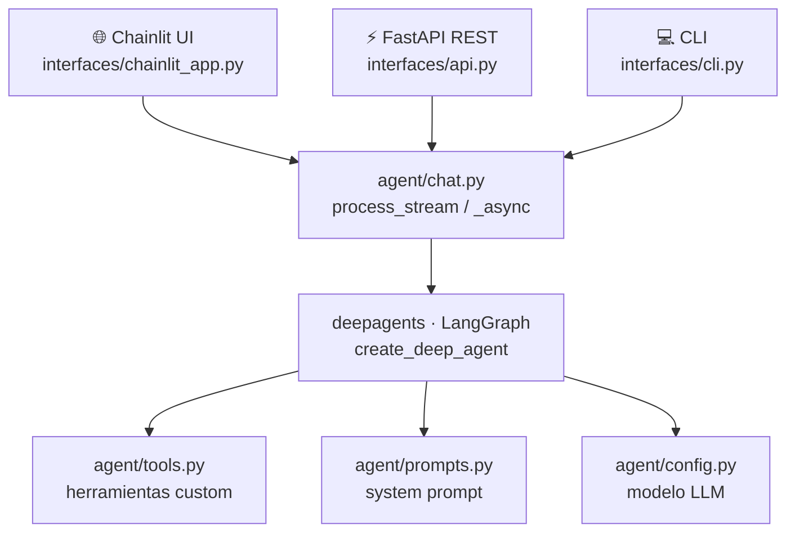

<p align="center">
  <h1 align="center">🤖 Deep Agents Example</h1>
  <p align="center">Deep agent conversacional con herramientas, memoria de sesión y múltiples interfaces</p>
  <p align="center">por <strong>Alex Zarate</strong> (aka Zamax)</p>
</p>

<p align="center">
  
  
  
  
</p>

---

## ¿Qué es esto?

Un agente LLM construido sobre [deepagents](https://docs.langchain.com/oss/deepagents) y LangGraph que puede usar herramientas, mantener historial de conversación y exponerse de tres formas distintas:

| Interfaz | Descripción |
|---|---|
| **Chainlit UI** | Chat web interactivo en `localhost:8000` |
| **FastAPI REST** | API HTTP con sesiones en `localhost:8001` |
| **CLI** | Loop de chat en terminal |

---

## Arquitectura
 


### Herramientas disponibles

**Usuario** (definidas en `tools.py`):
- `get_current_time` — fecha y hora actual
- `sum_numbers`, `subtract_numbers`, `multiply_numbers`, `divide_numbers` — aritmética

**Built-in deepagents**:
- `ls`, `read_file`, `write_file`, `edit_file`, `glob`, `grep` — filesystem
- `write_todos` — lista de tareas interna
- `task` — delegación a subagentes

---

## Inicio rápido

### Con Docker (recomendado)

```bash
# 1. Copia y completa el .env
cp .env.example .env
# Edita .env y pon tu OPENAI_API_KEY

# 2. Levanta todo
docker compose up --build

# Chainlit UI  →  http://localhost:8000
# FastAPI docs →  http://localhost:8001/docs
```

Para correr solo una interfaz:

```bash
docker compose up chainlit   # solo UI
docker compose up api        # solo REST
```

---

### Manual (local)

**Requisitos:** Python 3.12+

```bash
# 1. Entorno virtual
python -m venv .venv
source .venv/bin/activate   # Windows: .venv\Scripts\activate

# 2. Dependencias
pip install -r requirements.txt

# 3. Variables de entorno
cp .env.example .env
# Edita .env y agrega tu OPENAI_API_KEY
```

#### Chainlit UI

```bash
chainlit run interfaces/chainlit_app.py
# → http://localhost:8000
```

#### FastAPI REST

```bash
uvicorn interfaces.api:app --reload
# → http://localhost:8001/docs
```

Ejemplo de petición:

```bash
curl -X POST http://localhost:8001/chat \
  -H "Content-Type: application/json" \
  -d '{"message": "¿Cuánto es 42 + 58?", "session_id": "demo"}'
```

#### CLI

```bash
python -m interfaces.cli
```

---

## Estructura del proyecto

```
.
├── agent/
│   ├── chat.py         # Lógica de streaming (sync y async)
│   ├── config.py       # Inicialización del modelo LLM
│   ├── prompts.py      # System prompt y descripciones de tools
│   └── tools.py        # Herramientas custom del usuario
├── interfaces/
│   ├── api.py          # FastAPI — interfaz REST con sesiones
│   ├── chainlit_app.py # Chainlit — interfaz web de chat
│   └── cli.py          # CLI — loop de chat en terminal
├── chainlit.md         # Pantalla de bienvenida de Chainlit
├── requirements.txt    # Dependencias Python
├── Dockerfile          # Imagen base para ambos servicios
├── docker-compose.yml  # Orquestación: chainlit + api
└── .env.example        # Plantilla de variables de entorno
```

---

## Variables de entorno

| Variable | Descripción | Requerida |
|---|---|---|
| `OPENAI_API_KEY` | API key de OpenAI | ✅ |

Copia `.env.example` a `.env` y completa los valores.

---

## Agregar herramientas

Define una función en `agent/tools.py` y agrégala a `USER_TOOLS`:

```python
def buscar_clima(ciudad: str) -> str:
    """Retorna el clima actual de una ciudad."""
    ...

USER_TOOLS = [..., buscar_clima]
```

El agente la detecta automáticamente y la incluye en el system prompt.
